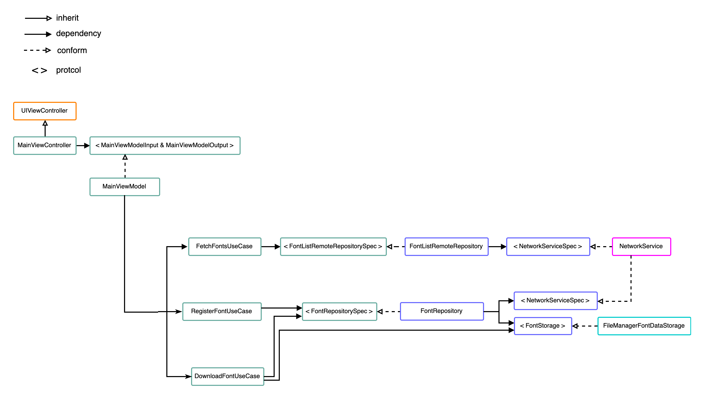

# GoogleFontPicker

-   Use clean architecture.
-   Without any third-party.(Use URLSession, custom Bindable, Native auto layout code)
-   It can be test, although haven't now.

PS. Network service is written before.

## Introduction

Dependency image, A color means it maybe a module.

And I will config those dependencies at a dependency injection container (`MainSceneDIContainer`)

PS. All use casies should make a protocol to inject to the view model.

## Naming define

-   DTO: Data transfer object, it conform `Decodable` and try to maintain JSON data structure, more changes key name.

-   Entity: The object with application logic.
-   View Object: The object for the view use.

-   Parameter: Represent call the api required parameter. (URL query string or http body.)